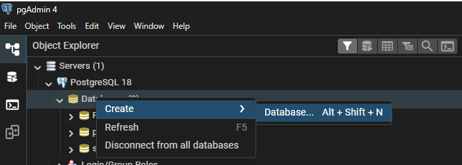
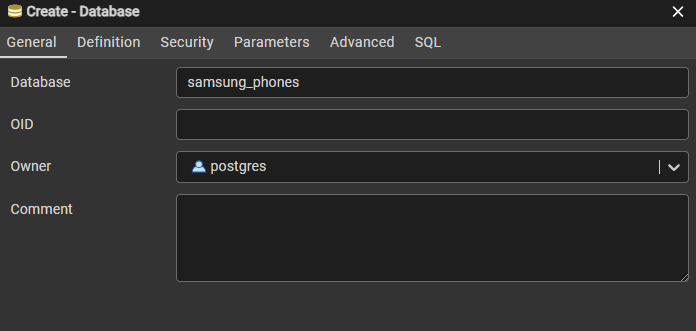
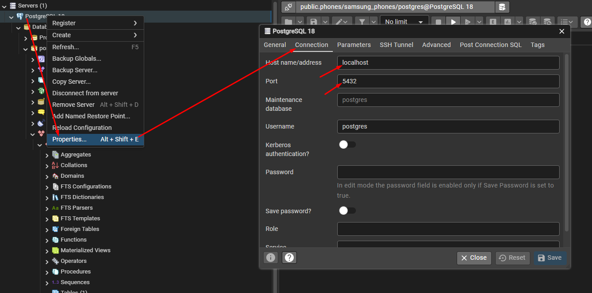
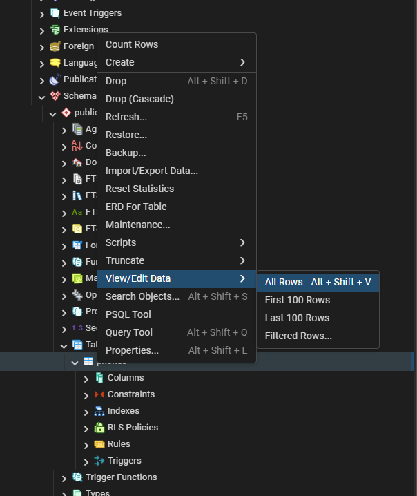
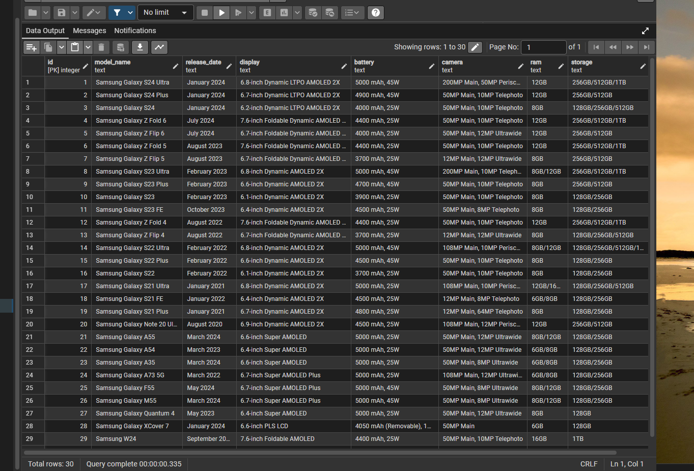
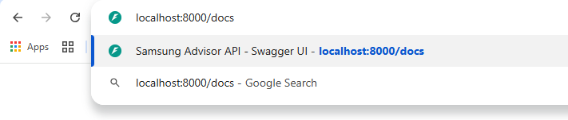
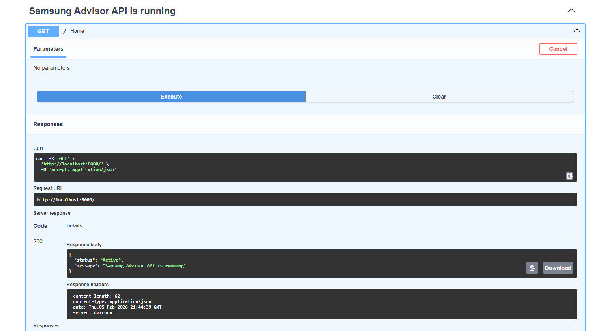
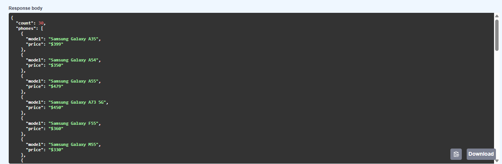

# Task 2: Samsung-Phone-Advisor
An intelligent AI-powered backend system that provides personalized Samsung phone recommendations using local LLMs (Ollama) and FastAPI.

## Features

- **AI-Powered Recommendations**: Uses Ollama (DeepSeek v3.1) to analyze user queries and provide intelligent phone recommendations
- **Phone Database**: PostgreSQL database storing Samsung phone specifications
- **Regular Expression module**: Intelligent extraction of multiple phone model names for comparisons
- **RESTful API**: FastAPI-based backend with clear endpoints for phone queries and recommendations
- **Automatic Setup**: Database tables and sample data are automatically seeded on server startup
- **Environment Management**: Secure configuration using .env files

## Tech Stack

- **Backend Framework**: FastAPI, Uvicorn
- **Database**: PostgreSQL with psycopg2
- **AI**: Ollama (DeepSeek v3.1 cloud)
- **Web Scraping**: BeautifulSoup, Requests
- **Validation**: Pydantic
- **Configuration**: python-dotenv

## Installation
## (1) Clone the repository
   ```bash
   git clone <repository-url>
   cd Samsung-Phone-Advisor
   ```
## (2) Create virtual environment

### Windows
```bash
python -m venv .venv
.venv\Scripts\activate
```
### Mac/Linux
```bash
python3 -m venv .venv
source .venv/bin/activate
```
## (3) Install dependencies
```bash
pip install -r requirements.txt
```

Running Cloud models
Ollama’s cloud models require an account on ollama.com. To sign in or create an account, run:

```bash
ollama signin
```
First, pull a cloud model so it can be accessed:

```bash
ollama pull deepseek-v3.1:671b-cloud
```
## PostgreSQL





Create a `.env` file in the project root:
   ```
   DB_NAME=samsung_phones # example
   DB_USER=your_db_user
   DB_PASSWORD=your_db_password
   DB_HOST=localhost
   ```
## Project Structure


```yaml
├── main.py               
├── db_setup.py          
├── scraper.py            
├── requirements.txt     
└── README.md            
```

---


▶️ How to Run into terminal
```cmd
python main.py
```
or
```cmd
python db_setup.py
python main.py
```

### Check Database value




The API will be available at `http://localhost:8000`

### API Documentation

- **Swagger UI**: `http://localhost:8000/docs`
- **ReDoc**: `http://localhost:8000/redoc`


## Swagger UI



### Example Endpoints

#### Get All Phones
```bash
GET /
```


#### Get Phone by Model
```bash
GET /phones
```


#### AI Recommendation
```bash
POST /ask
Content-Type: application/json

{
  "question": "What Samsung phone should I buy for photography?"
}
```

## API Response Example

```json
{
  "phone_model": "Galaxy S24 Ultra",
  "specs": {
    "display": "6.8\" AMOLED 120Hz",
    "camera": "200MP main camera",
    "battery": "5000mAh",
    "storage": "512GB",
    "price": "$1299"
  },
  "review": "The Galaxy S24 Ultra is perfect for photography enthusiasts with its advanced computational photography and AI features..."
}
```


## Database Schema
```
             id SERIAL PRIMARY KEY,
                model_name TEXT UNIQUE,
                release_date TEXT,
                display TEXT,
                battery TEXT,
                camera TEXT,
                ram TEXT,
                storage TEXT,
                price TEXT
```

### Code Structure

- **main.py**: Handles FastAPI endpoints and request processing
- **db_setup.py**: Database connection and query functions
- **scraper.py**: Web scraping utilities for data collection


## Troubleshooting

### Database Connection Error
Ensure PostgreSQL is running and credentials in `.env` are correct

### Ollama Error
Ensure Ollama is running (`ollama serve`) and you have pulled the model (`ollama pull deepseek-v3.1:671b-cloud`)

### Port Already in Use
Change port in startup command: `uvicorn main:app --port 8001`
